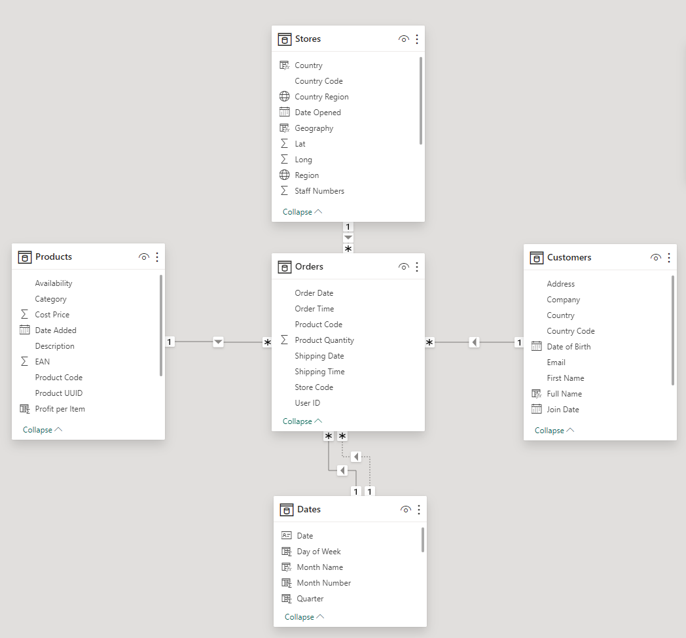
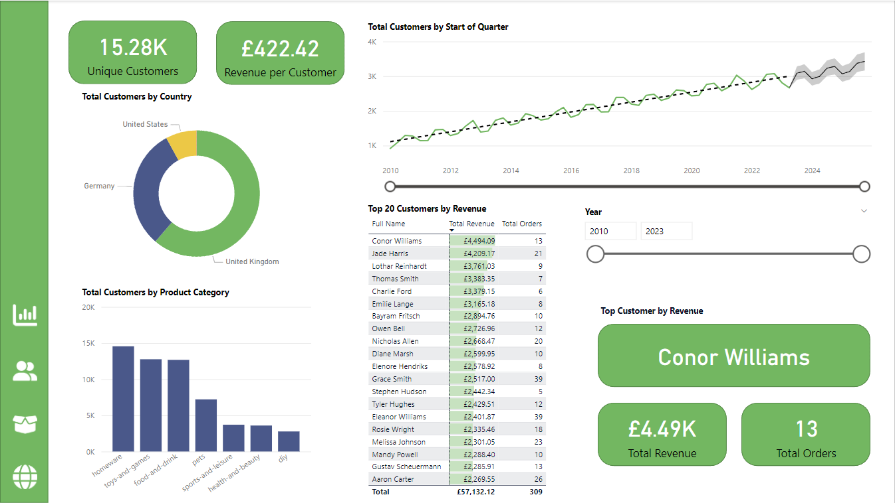
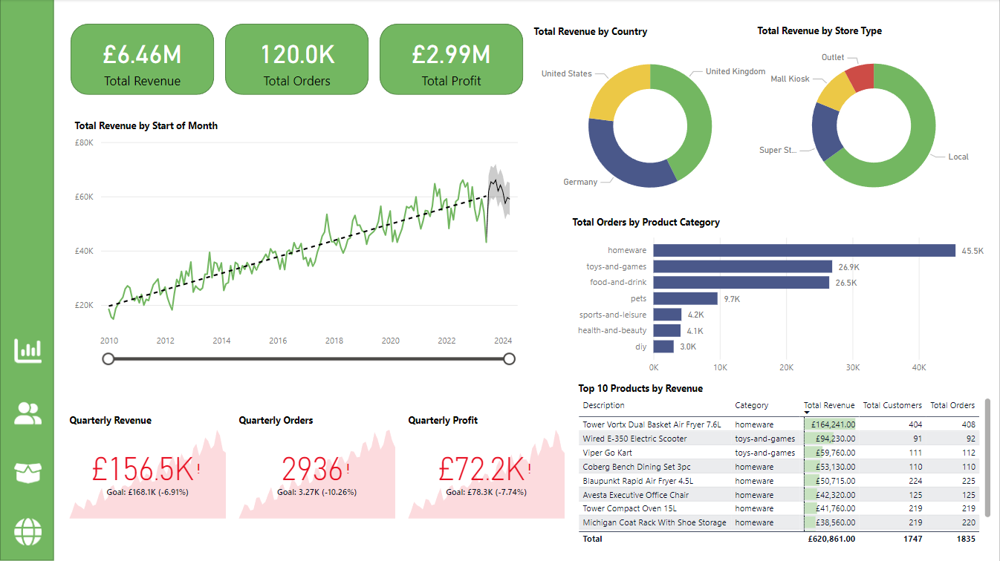
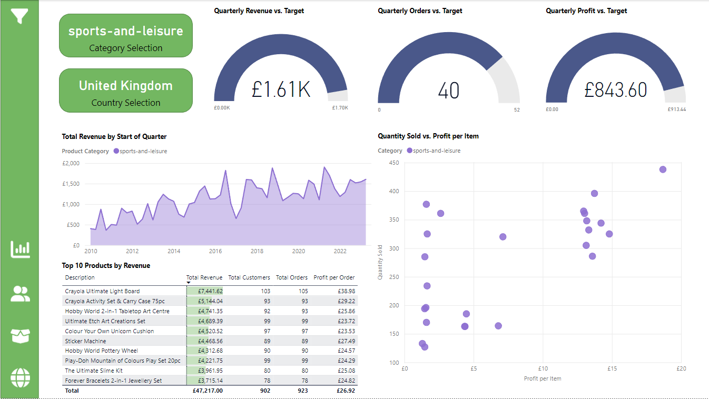
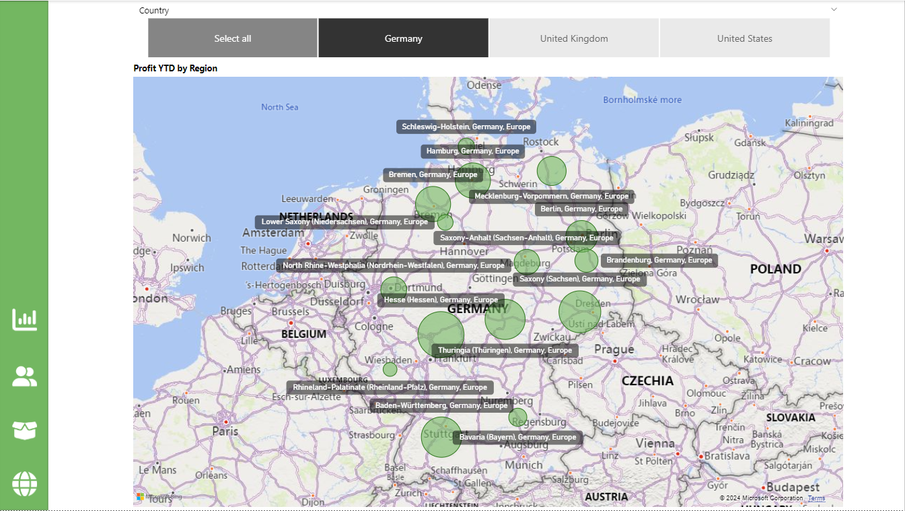

# Data Analytics Power BI Report

The following section will describe how the project was made.
## 1. Importing the data into Power BI
### 1.1 Loading and transforming the Orders table
First I loaded the Orders table (the main fact table) from an Azure SQL database into Power BI, using the Get Data option in the home tab of the ribbon. Then I made transformations to the data using the Power Query Editor. I deleted the [Card Number] column to ensure data privacy. I used the Split Column feature to separate the [Order Date] and [Shipping Date] columns into distinct columns for the date and time. I filtered out rows where the [Order Date] column had missing values to maintain data integrity and renamed tthe columns to align with Power BI naming conventions.
### 1.2 Importing and transforming the Products dimension table
I began by importing the data from a local csv file. In the Power Query Editor I used the Remove Duplicates function on the [Product Code] column to ensure each product code is unique. I used the Column from Examples feature to generate two new columns from the weight column, one for the values and another for the units. I created a new calculated column where if the units were not in kg, the corresponding value would be divided by 1000 to convert it to kg. I also deleted columns that were no longer needed.
### 1.3 Importing and transforming the Stores dimension table
I imported the Stores table from Azure Blob Storage into Power BI. I used the Replace Values feature to remove some typos in the [Region] column and renamed the columns for consistency.
### 1.4 Importing and transforming the Customers table
The customers table was initially split across 3 csv files in a folder on my local machine, one for each region where the company operates. I used the Combine and Transform feature in Power BI to append the three files into one query. I created a Full Name column from the combination of the [First Name] and [Last Name] columns and deleted the index column.
## 2. Creating the data model
### 2.1 Creating a date table
I used the DAX formula `Dates = CALENDAR(MIN(Orders[Order Date]), MAX(Orders[Shipping Date]))` to create a continuous date table to act as a basis for time intelligence in the data model. I then populated the table with more columns to support my analysis, such as `Start of Quarter = STARTOFQUARTER(Dates[Date])`.
### 2.2 Building the star schema data model
I navigated to the model view in Power BI to create the star based schema, with the Orders table at the centre. I established the relationships between the tables, such as Orders[Product Code] to Products[Product Code]. The complete data model looks like this:

### 2.3 Creating a Measures table
I used the Enter Data feature in the model view to load a new blank table for my measures. This helps to keep the measures used in the analysis organised.
### 2.4 Creating key measures
I then wrote DAX formulas to create measures in the Measures table, which will be vital for the analysis. Some examples include `Total Profit = SUMX(Orders, Orders[Product Quantity] * (RELATED(Products[Sale Price]) - RELATED(Products[Cost Price])))` and `Profit QTD = TOTALQTD([Total Profit], Dates[Date])`.
### 2.5 Creating date and geography hierarchies
Next I had to establish hierarchies to facilitate drilling-down into the data. For the dates, I arranged a hierarchy in the following order: Start of Year -> Start of Quarter -> Start of Month -> Start of Week -> Date. The geography hierarchy is Region -> Country -> Country Region.
## 3. Setting up the report
I navigated to the Report View and created the four pages that would comprise my report. I selected the City Park colour theme under the View tab. I also inserted a rectangular shape on the left edge of the first page and copied it to the other pages, which would serve as a navigation sidebar.
## 4. Building the Customer Detail page
For each visual, I selected the type of visual to create in the visualisation pane and then dragged across the fields to plot from the data pane. Then I adjusted the formatting in the Format pane. For the Customer Detail page, I added card visuals of unique customers and revenue per customer. I added a donut chart for total customers by country and a column chart of customers by product category. I also included a line chart, table and a date slicer, so users can filter the page by year. The finished page looks like this:

## 5. Building the Executive Summary page
On this page I included card visuals for total reveue, orders and profit, a graph of revenue against time, donut charts for revenue by country and store type, a bar chart of orders by product category, KPIs for quarterly revenue, orders and profit, and a table of the top 10 products by revenue. The finished page looks like this:

## 6. Building the Product Detail page
On this page I added gauge visuals for quarterly performance against a target, an area chart showing revenue of each product category over time, a table for top 10 products by revenue, and a scatter graph of quantity sold against profit per item. I then included slicers for product category and country, and enclosed them in a slicer toolbar so that they are only revealed when the user wishes to change the filters applied to the visuals, in order to keep the page free of clutter. This was achieved using two bookmarks, one with the toolbar open and the other with it closed, and two buttons with their actions assigned to the different bookmark states. The finished page (with the toolbar collapsed) looks like this:

## 7. Building the Stores Map page
This page focuses on a map of the stores, with the geography hierarchy as the location field and profit YTD as the bubble size. There is a slicer to filter by country, and a drillthrough page, which shows further details regarding a selected store's performance. I also created a tooltip page with a gauge visual of profit YTD against a target, which can be seen by hovering the mouse over the bubble of a region on the map. The finished page looks like this:

## 8. Cross-filtering and navigation
Next I used the Edit Interactions view in the Format tab of the ribbon to disable some of the cross-filtering (where clicking on a data point of one visual affects the others),only for visuals where the output becomes confusing. I also finished the navigation sidebar by assigning actions to the buttons that linked each one to one of the four main pages of the report.
## 9. Creating metrics using SQL
Lastly, to gain insight into the data without reliance on Power BI, several questions were answered using SQL queries, with the results exported to csv files.